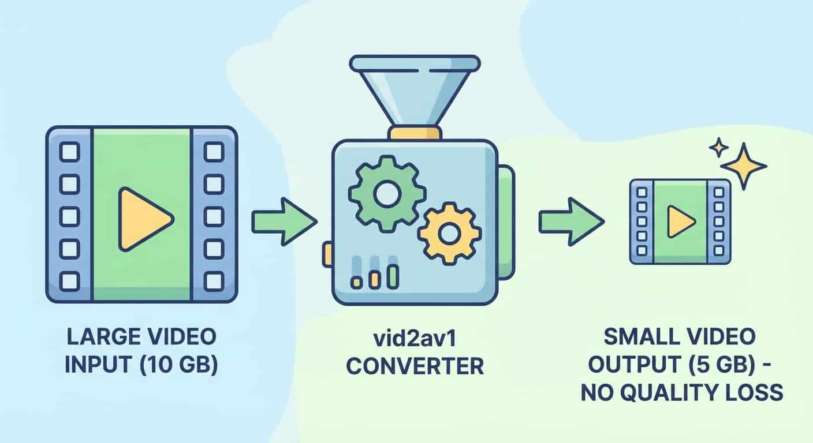
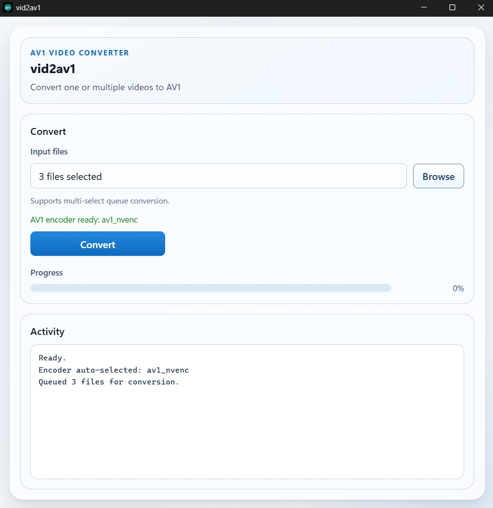

# vid2av1

Reduce video file size by half. Every time.

Stop wrestling with converter settings and codec choices. `vid2av1` does the hard part for you, using AV1 to consistently target a video file size that is **50% of the original**.



`vid2av1` is an open source Windows desktop app built for simplicity and speed, with best-in-class performance on NVIDIA RTX GPUs.
In most real-world cases, the loss in visual fidelity is minimal and often almost imperceptible thanks to AV1 efficiency.
Under the hood, it leverages FFmpeg and modern AV1 encoders.



## For Users

### The core promise
- **Half-size output target on every conversion**.
- Convert one or multiple files in one run.
- Get live progress, speed, ETA, and cancellation support.
- Keep your files local. No cloud upload.

### Best experience
- Windows
- NVIDIA RTX GPU
- Non-RTX GPUs have not been tested, but fallback AV1 encoders are available so it should still work (don't expect the same speed).

Other available AV1 encoders:
`libsvtav1`, `libaom-av1`, `librav1e`, `av1_qsv`, `av1_amf`, `av1_mf`, `av1_vaapi`.

### Quick start
1. Download the app from Releases.
2. Run `vid2av1-gui.exe`.
3. Click `Browse`, pick one or more videos, then click `Convert`.

### Output behavior
- Output is created next to the source video.
- Name format: `<original-name>.av1.mp4`.
- Conversion planning always targets **50% of source size**.

## For Developers

### Stack
- Tauri 2 (desktop shell + IPC)
- Rust backend (`src-tauri/`) for planning, probing, and process control
- TypeScript frontend (`ui/`) for queue UX and progress presentation

### Runtime architecture
1. UI invokes Tauri commands (`convert_video`, `cancel_conversion`, `pick_auto_av1_encoder`).
2. Backend builds a conversion plan:
   - Resolves `ffmpeg.exe` and `ffprobe.exe`
   - Probes duration + audio bitrate with ffprobe
   - Computes target video bitrate for ~50% output size
3. FFmpeg is launched with structured progress output (`-progress pipe:1`).
4. Backend emits `convert-progress` events to the UI until completion or cancellation.

Core command surface is in `src-tauri/src/commands.rs`.
Planning/bitrate logic lives in `src-tauri/src/convert/planning.rs`.
Progress/process management is in `src-tauri/src/convert/ffmpeg_runner.rs`.

### Prerequisites
- Windows
- Node.js + npm
- Rust stable toolchain
- Tauri prerequisites for Windows

### Install
```powershell
npm install
```

### Run in development
```powershell
npm run dev
```

### Build portable release
```powershell
npm run build
```

### FFmpeg dependency model
- FFmpeg is auto-managed by `scripts/ensure-ffmpeg.mts`.
- If binaries are missing, it downloads and extracts:
  - `ffmpeg.exe`
  - `ffprobe.exe`
- Installed location: `vendor/ffmpeg/bin/`
- Optional override: set `FFMPEG_DOWNLOAD_URL` to use a different archive source.
- `vendor/ffmpeg/bin/` is gitignored to avoid committing vendor binaries.

### FFmpeg path resolution at runtime
The backend searches several candidate locations so dev and release layouts both work:
- Tauri resource directory (`vendor/ffmpeg/bin`, `ffmpeg/bin`, root)
- Executable directory and parent
- Workspace-relative `vendor/ffmpeg/bin`

Reference: `src-tauri/src/ffmpeg/path_resolution.rs`.

Build output:
- `src-tauri/target/release/` (app binary)
- FFmpeg binaries staged there for portable use by `scripts/stage-portable.mts`

### Project layout
- `src-tauri/`: Rust backend, Tauri commands, FFmpeg integration
- `ui/`: TypeScript UI
- `scripts/`: build and staging scripts
- `vendor/ffmpeg/bin/`: Auto-managed FFmpeg binaries (`ffmpeg.exe`, `ffprobe.exe`)

### Scripts
- `npm run ui:build`
- `npm run scripts:build`
- `npm run ts:build`
- `npm run ffmpeg:ensure`
- `npm run dev`
- `npm run build`

### Troubleshooting
- `Could not find ffmpeg.exe` or `ffprobe.exe`:
  - Run `npm run ffmpeg:ensure`
  - Verify files exist in `vendor/ffmpeg/bin/`
- Download blocked on first run:
  - Set `FFMPEG_DOWNLOAD_URL` to an accessible mirror
  - Re-run `npm run ffmpeg:ensure`
- Portable output missing FFmpeg binaries:
  - Re-run `npm run build` and confirm copy logs from `stage-portable`

### Open source
Contributions are welcome through issues and pull requests.

## License
This project is licensed under the MIT License. See `LICENSE` for details.
